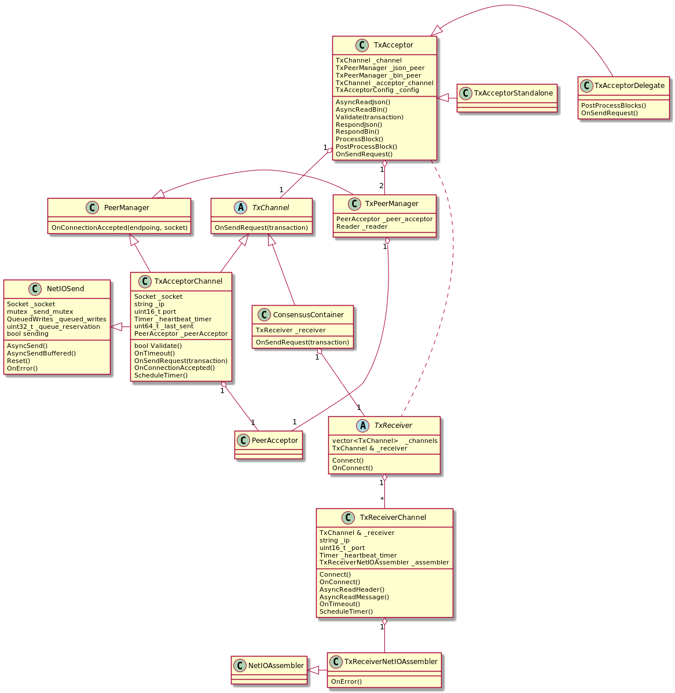
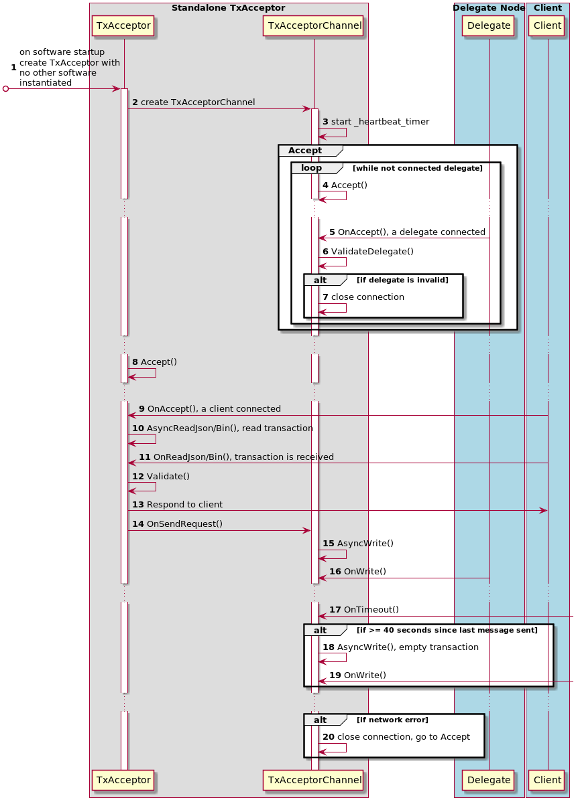
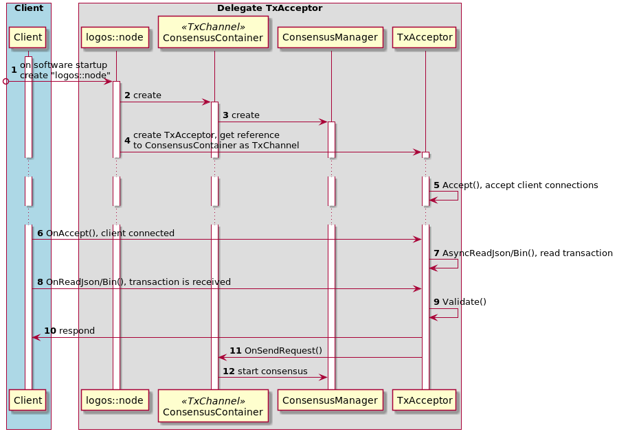
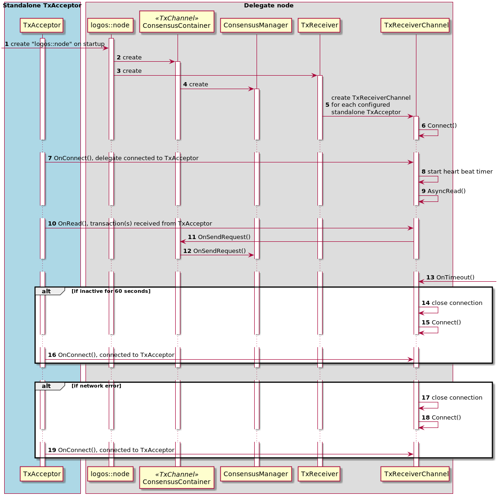

# TXAcceptor

## Overview

TxAcceptor is a subsystem that independently participates in the public P2P network. Its role is to verify incoming P2P messages and relay them to other nodes e.g. the Delegate. The logic is extremely simplified and adds little latency. IP's of public TxAcceptor's are broadcasted via key-adv (TBD). A Delegate could have multiple TxAcceptor's. TxAcceptor mitigates the risk of DDoS attacks. Since the Delegate's private IP is not available, an attacker can only flood publicly addressable TxAcceptor with requests. This can bring down TxAcceptor and possibly preclude the Delegate from receiving transactions from the TxAcceptor but doesn't prevent the Delegate from participating in the consensus protocol.  Moreover, the Delegate can quickly spin-up new instances of TxAcceptor in order to continue processing transactions and making it difficult for the attacker to carry on with the meaningful attack. 

## Supported Configurations

In the TxAcceptor's design, configuration file is used to announce public IP's of a delegate. The type of run-time configuration of TxAcceptor is communicated via configuration file and command line options passed to the software. Note that configuration between TxAcceptor and delegate can be also configured with the full node graphical software. Currently there are three types of supported configuration: 
- Standalone. Accept transactions and forward them via TCP/IP to the delegate. No other functionality is supported by the node.
- Standalone and P2P subsystem. Same as above but in addition P2P subsystem is instantiated and operates on a separate communication channel.
- Integrated with the Delegate. TxAcceptor runs in the same node (same process) as the Delegate and transactions are forwarded via messages (presently a function call in the same binary). 

On startup the core software parses configuration file and command line options and determines what objects have to be instantiated to support requested configuration. In the standalone mode only TxAcceptor and optionally P2P classes are instantiated; i.e. the node and all of its dependent classes are not instantiated. Consequently, spinning up of a TxAcceptor executable in this mode is fast.

## Class Diagram

The class diagram is shown of Figure 1.

 
Figure 1. TxAcceptor class diagram.

TxAcceptor functionality is implemented by five classes:
- TxChannel is a channel abstraction for forwarding transactions. ConsensusContainer, TxAcceptorChannel, and TxReceiverChannel implement this class.
- TxAcceptor accepts client's connection via TxPeerManager/PeerAcceptor and asynchronously reads transaction(s) (AsyncReadJson(), AsyncReadBin(), OnReadJson()). Received transaction(s) is validated (Validate()) and on success is asynchronously forwarded to the delegate via TxChannel (_acceptor_channel). The client is informed of failed and successfully forwarded transactions. The client's connection is closed after forwarding. In standalone mode TxAcceptor and optionally P2P are instantiated without instantiating of logos::node class and with a minimal required system's support (boost asio). When integrated with the delegate, TxAcceptor is instantiated and contained within logos::node object. In this mode, TxChannel is represented by ConsensusContainer's reference. 
- TxAcceptorChannel accepts TCP/IP connection from a delegate. The connection is validated with ValidateDelegate() and is rejected for an invalid delegate (TBD). The channel forwards transactions with OnSendRequest(). OnSendRequest() internally buffers transactions since boost's AsyncWrite can not handle concurrent writes on the same socket. The channel is instantiated in standalone mode and is owned by TxAcceptor. The channel is closed on socket error. A newly accepted connection closes the old connection; i.e. TxAcceptor supports only one connection to the delegate. TxAcceptorChannel sends a heartbeat message after inactivity of 40 seconds (_timer, OnTimeout()).
- TxReceiver is instantiated by the delegate having external TxAcceptor. TxReceiver instantiates TxReceiverChannel(s). It is container for all delegate's connections. TxReceiver is not instantiated when TxAcceptor is integrated with the delegate.
- TxReceiverChannel is instantiated by TxReceiver. It connects to configured TxAcceptor's (Connect(), OnConnect()), receives transactions (AsyncRead(), OnRead()), and forwards them to consensus handling objects via _receiver. The channel's socket is closed after inactivity of 60 seconds and a new connections is attempted after 5 seconds.

## Messages

There are two types of messages handled by TxAcceptor: Transaction and Heartbeat. Heartbeat message is Transaction message with 0 pay-load. The message could be formatted as either binary or Json. Heartbeat message is only sent in binary format and is only handled when a delegate has standalone TxAcceptor. Both binary and Json format message represent batch of single state blocks. The blocks are serialized without the header.

### Binary message format
| Field Name | Size | Description|
| --- | ---- | ---- |
| Version | 1 | Logos core protocol version|
| Message Type| 1| Type of message|
|MPF|2| Multipurpose field|
|Total Payload Size|4|(Size of the message - size of the header) * number single state blocks|
|Single State Block(s)| Total size of all blocks | 0 or more serialized Single State Block(s)|

### Json message format

This is an example of a single transaction in Json format. Note that the value for the "block" key is a string in Json format.
"blocks" : [{
	"action": "process", 
	"logos": "logos", 
	"block": "{"account": "lgs_3e3j5tkog48pnny9dmfzj1r16pg8t1e76dz5tmac6iq689wyjfpiij4txtdo",
			 "previous": "C307BB936A114CB1F5218263A988A1B7A2E472C7672E8F2BB523CDAB3119AEA4",
			 "sequence": "65",
			 "transaction_type": send",
			 "transaction_fee": "10000000000000000000000",
			 "signature": "B084473A80144392A3365016357B9B6507DA1316A61C9D3EB21DE1153FA8EC62BCC42E91A5BC58E8C485F52D707A61F4B3E4F87948E4EC9407C449D15922AF0C",
			 "work": "14236726370",
			 "number_transactions": "1",
			 "transactions": [{
			 	"target": "lgs_1pt9uigtkn68rm16tzmabyzybpkj7nzxtdj499umnef1ock6xgmr7sfssuw6",
			 	"amount": "1000000000000000000000000000"
			 }],
			 "hash": "7EE14913CD583BFE35AA1649C2DDBE33CDE2EB8F91E0AA2E7C09C7A91DDF7A77"}"
}]

## TxAcceptor instantiation and transaction forwarding

TxAcceptor instantiation and transaction forwarding is shown on sequence diagram on Figure 2 - Standalone mode and Figure 3 - Delegate mode.
 
Figure 2. Standalone mode

 
Figure 3. Delegate mode

When running in standalone mode, TxAcceptor class is instantiated outside of the logos::node class. The logos::node class and consequently all other contained within it classes are not instantiated. Boost asio threads and service are instantiated in order to provide asynchronous socket and timer operations. TxAcceptor instantiates TxAcceptorChannel class which starts accepting connection from the delegate. Note that non-delegate node should not attempt to connect to TxAcceptor. Heartbeat timer is started with the timeout set at 15 seconds.

In delegate mode, TxAcceptor is instantiated by the logos::node class and is passed ConsensusContainer reference, which in this mode represents the TxChannel.

In either mode TxAcceptor accepts a client's connection request. Once connected, TxAcceptor reads client's transaction request. Received transactions are validated and valid transactions are forwarded to TxChannel object. In the standalone mode TxChannel writes transactions to the socket. In the delegate's mode TxChannel calls ConsensusContainer's OnSendRequest().

When Timeout() is received in standalone mode, TxChannel sends an empty transaction if the time since the last forwarded transaction exceeds 40 seconds. 

If a network error is received in standalone mode then TxChannel closes the socket and starts accepting connection from the delegate (step 4).

## TxReceiver instantiation and transactions receiving

TxReceiver instantiation and transaction receiving is shown on sequence diagram on Figure 4.
 
Figure 3.

TxReceiver receiver is only instantiated by the delegate when TxAcceptor is instantiated as standalone. ConsensusContainer reference is passed to TxReceiver as TxChannel. 

TxReceiver instantiates TxReceiverChannel and adds it to the _channels. Once instantiated, TxReceiverChannel connects to standalone TxAcceptor. Once connected, the delegate has to authenticate itself to TxAcceptor (TBD). Currently TxAcceptor accepts any delegate's connection. After the connection is validated (TBD), TxReceiverChannel asynchronously receives transactions from TxAcceptor. When transaction is received, it is forwarded to consensus via ConsensusContainer (steps 11,12).

When Timeout() is received in standalone mode, TxReceiverChannel closes connection if the time since the last received transaction exceeds 60 seconds. TxReceiverChannel then attempts to reconnect to TxAcceptor. The same sequence is repeated in case of a network error.

## Implementation

Current configuration file is extended with tx_acceptor section containing an array of each TxAcceptor pubic IP and ports. Configuration below is an example of a delegate configured with two TxAcceptor's. On startup a delegate node reads this configuration and creates the instance of TxReceiver class with two instances of TxReceiverChannel classes which attempt connecting to the configured TxAcceptors. TxReceiver instance is created as part of the logos::node class initialization.

"TxAcceptor" : {
"tx_acceptors" : [
	{
		"ip" : "172.1.1.0",
		"port" : "55001"
	},
	{
		"ip" : "172.1.1.0",
		"port" : "55001"
	}
],
"delegate_ip":"172.1.1.1",
"acceptor_ip":"172.2.2.2",
"port": "56000",
"json_port": "56001",
"bin_port":"56002"
}

If "tx_acceptor" configuraiton is empty then the TxAcceptor class is instantiated by the logos::node class. In this case TxAcceptor does not create TxAcceptorChannel. Instead it is passed a reference to ConsensusContainer as TxChannel.

When logos_core software is launched with "--tx-acceptor" command line argument TxAcceptor runs in standalone mode. It only creates instance of TxAcceptor class and doesn't create the logos::node instance. TxAcceptor class creates instance of TxAcceptorChannel class which accepts connections from the delegate. "delegate_ip" is private delegate's IP that TxAcceptor represents. "acceptor_ip" and "port" are TxAcceptor's ip port for accepting delegate's connection and ip for accepting client's connections. "json_port" is TxAcceptor's port for accepting client json transactions. "json_bin" is TxAcceptor's port for accepting client binary transactions.

When logos_core software is launched with "--p2p" command line argument, it instantiates p2p subsystem independently of the logos::node.

Note that --tx-acceptor and --p2p options are mutually exclusive with --daemon option.

### TxChannel abstraction

The abstraction enables TxAcceptor to send received from a client transaction(s) to either a delegate node when running as standalone or to ConsensusContainer to start consensus protocol when running as delegate. This is done by instantiating TxAcceptorChannel in former  and passing ConsensusContainer reference in latter cases. In TxReceiver the abstraction forwards received transaction to ConsensusContainer to start consensus protocol. 