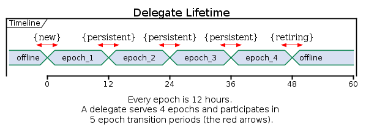
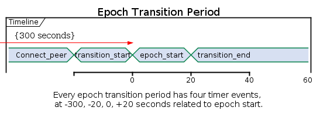

# Logos Network System Design Overview

This document summarizes the high level system components that reside within the Logos core software. The break down of the components are purely functional and does not reflect the actual software design. This document gives a clear view of all functional subsystems of the Logos core. For details software design and its associated logical break down, please reference the detailed software design.

## Functional Components

The Logos core software is a direct implementation of Logos core software requirement document (SRS) and it realizes the requirements detailed in the document. The SRS itself is directly derived and traced back to the white paper. This allows the software the software to directly reflect the design of the white paper. There are many functional components required to realize the design and they go beyond what are called out in the white paper. The entire core software can be broken down into the following functional components:

- Boostrapping
- Consensus 
- P2p backup consensus
- Elections
- Epoch Transition
- Micro Epoch and Epoch
- P2p 
- Heartbeat and Reconnection
- Token platform
- TxAcceptor
- Staking
- Fees
- RPC 
- Database

In the following sections, this document gives a summary of its capabilities. For details design, refer to the Software Design Documents (SDD)

## Bootstrapping
### Overview
Bootstrapping is the process by which a node sync's up to the network's
current state. For example, if a node is brand new, it needs to get the
correct database from its peers as it starts off with no data. The process
by which it gets these blocks is called bootstrapping. Another use-case is
when we fall out of sync with the network. For example, when a given node
crashes or needs to be restarted, it has to sync up with the network from
the current state once it comes back online.


### Execution concept
 The bootstrapping approach taken by Logos is to update batch state blocks, micro blocks and epoch blocks. We 
do not update using accounts or individual state blocks. All the blocks are serialized/deserialized instead of being copied. 
This gives us the advantage of serializing only what we need for the batch 
state blocks increasing performance of the system.

Bootstrapping is initiated in an alarm, and starts off by getting the information
needed to decide if its ahead or behind. This information, referred to as tips
represents the last blocks in the database for a given chain. We decide if we
are ahead by checking sequence numbers on the peer. In the case where the bootstrap
node is actually ahead of the bootstrap peer, the sequence numbers of the peer
will be less than those of the bootstrapping node. Once this is determined, we do not
bootstrap from that peer, and the peer initiates a bootstrap on its end to sycn up.
We do not push blocks to peers in this design.

Once we decide we are behind (our sequence number is less than the peer), we issue
a pull request for the blocks we are behind on. Once we receive the blocks, we
are able to validate and apply them to the database. Note that the order of retrieving blocks
works by going micro block to micro block such that each of the batch state blocks of the current
micro is downloaded and validated/applied prior to the current micro. And once the batch state blocks
are all applied, we validate/apply the current micro block. We then proceed to get the next
micro block in the system. If we reach the last micro block in an epoch, we get the next
micro and the next epoch after we validate the current epoch.

The basic algorithm is as follows:
 
~~~ C++
        while (true) {
        	get tips from peer
        	if behind for delegate i
        		request a pull request
        }
~~~

And subsequently, the bootstrap client logic will issue a request from the peer for the pull requested. 

~~~ C++
		while (still_pulling) {
			send peer a request for the pull
			receive the response in the form of a 
				block type
			validate/apply the block
		}
~~~

Currently, the system supports retrieving epoch, micro, and batch state blocks.

## Consensus
### Overview
Logos builds on the best components of existing cryptocurrency networks while introducing innovations that enable its primary goals: practical scalability, fully aligned incentive structure, and security in the presence of Byzantine faults. Its base data structure is the chain mesh, a directed acyclic graph (DAG) consisting of a dedicated chain of transactions for each account. Transactions are processed in parallel rather than in blocks, and consensus is achieved via Axios, a delegated Practical Byzantine Fault Tolerance (dPBFT) algorithm that provides both liveness and safety as long as more than * 2⁄3 * of nodes by holdings are honest.

Axios is a PBFT-derived algorithm that allows for large, dynamic node sets to achieve consensus on transactions, votes, and epoch blocks. Each instance of PBFT requires a single leader called the primary to propose transactions and manage feedback from the other validators.

Axios has three primary phases to reach consensus:
* **Pre-Prepare: ** the primary announces a network operation to be considered for consensus, signed by the primary.
* **Prepare: ** every node checks the validity of the operation and send a signed prepare message to the primary if it agrees the operation is safe and valid. The leader waits for prepare messages from more than * 2/3 * n of nodes to construct a post-prepare message containing the multisignature of the agreeing nodes along with the corresponding bitmap identifying those nodes.
* **Commit: ** Upon receiving proof that more than * 2/3  n  *nodes signed prepare messages for the operation (via the post-prepare message), a node sends a signed commit message to the primary. The leader waits for commit messages from more than * 2/3  n * of nodes to construct a post-commit message containing the multisignature of the committing nodes along with the corresponding bitmap identifying those nodes. The post-commit is then disseminated across then network as proof that consensus has been reached, and all nodes update their ledgers accordingly.

At a very high level, the consensus module essentially boils down to three main components:
* ```PrimaryDelegate```
* ```ConsensusManager```
* ```ConsensusConnection```

#### PrimaryDelegate
The PrimaryDelegate is responsible for receiving and validating consensus messages sent by backup delegates. It aggregates messages sent by backups and upon receiving approving responses from more than * 2/3 * of backups, responds with a message containing the aggregated signature of the responding delegates.

#### ConsensusManager
The ConsensusManager acts as the primary interface for the Consensus module and handles the bookkeeping done before consensus is initiated and after consensus is reached by the delegates.

#### ConsensusConnection
The ConsensusConnection maintains a connection to a single remote peer. This class is used by the PrimaryDelegate to send messages to remote delegates, and also receives messages sent by remote delegates.

### Execution Concept

#### Threading
The consensus module executes on top of the Boost asio threadpool. This threadpool is created by spawning threads at the start of the application and calling ```service.run()``` on each thread. The module then responds to IO events such as transaction requests from clients received from the network, or messages from other delegates.

#### Axios Concurrency
For each type of consensus (BatchStateBlock, MicroBlock, EpochBlock, etc.), a delegate node will have one instance of the ```PrimaryDelegate``` class and * n-1 * instances of the ```ConsensusConnection``` class (where *n* is the number of delegates in the distributed system). A ```PrimaryDelegate``` instance can only lead a single instance of consensus at a time. The ```PrimaryDelegate``` leading consensus and the ```ConsensusConnection``` instances serving as backups occur in parallel.

#### Consensus Sequence

Please note that the designation of one node as a primary and the rest as backups is determined by the client. The recipient of the client's transaction request will be the primary for with respect to that request, and the others will serve as backups.


## P2p Backup Consensus

### Overview

Preferred way of exchanging consensus messages between the delegates in the logos core software is direct TCP/IP connection. When consensus protocol does not reach two-third majority, a primary delegate enables P2p subsystem for a consensus message propagation in addition to the TCP/IP connection. When a backup delegate receives the consensus message from P2p subsystem, it responds to the primary delegate via both TCP/IP and P2p subsystem. The primary delegate keeps on using TCP/IP and P2p to exchange consensus messages until it deduces that P2p subsystem is no longer needed for the consensus message propagation. When the backup delegate stops receiving consensus messages via P2p subsystem, it discontinues propagating consensus messages via P2p subsystem.

### Protocol

P2p consensus message is layered on top of P2p PROPAGATE message. P2p broadcasts messages to all delegates. This means that some delegates will receive messages that should not be directred to them. While  the delegate can correctly identify these type of messages and discard them, it'll use the delegates resources. This could be addressed at the level bellow consensus protocol. mpf field of MessagePrequel can be used to add destination delegate id and epoch number which allow delivering the message to the correct delegate.

## Elections

### Introduction

The elections component includes components that allow accounts to become
representatives, and components that allow those representatives to vote
for delegates. Staking itself is a closely related but separate
component.

Nearly every command supported by the elections component has a one epoch
lag before it takes effect. For instance, to become a candidate, an
account will announce their candidacy in one epoch, and then potentially
be voted for in the following epoch.  The
thought process behind this decision is that while voting is happening,
very few aspects of the system are changing. The system changes all at
once during epoch transition. This gives our system some level of
stability.

Furthermore, many actions surrounding voting, delegate candidacy and
representative status are only allowed once per epoch. A representative
can vote once per epoch, a delegate candidate cannot declare candidacy
and then renounce that candidacy in the same epoch, etc. 

Lastly, delegates serve a fixed length term, currently 4 consecutive epochs.
However, delegates are allowed to run for reelection in such a way that 
they serve consecutive terms. In fact, the long term vision of the network
is to have a stable delegate set, that changes very little between epochs.

### Overview

The elections component is not a single component but a collection
of additions to existing components.

* New structs that inherit from ```Request```
* Logic within consensus to process these new ```Request``` types
* Representatives database and candidates database 
* Logic during epoch transition and epoch block creation  

The state diagrams and sequence diagrams are at the end of the document,
as these are simply visualizing the requirements.

### Execution Concept

The processing of Requests related to elections follows the same execution
model as processing any other type of Request (Send for instance) and spawns
no new thread or does anything special.

The updating of the candidates database on epoch transition 
is done as part of applying the
updates for an epoch block. We will also delete any retiring
representatives from the representatives database when applying 
the updates for
an epoch block, but this will be done asynchronously in another thread,
as nothing depends on deleting the representatives. It is simply a
pruning operation.

Voting will be rejected during the last ten minutes of an epoch, as well
as the first ten minutes. This is to avoid race conditions on the epoch
boundary. Candidacy requests and representative requests can still be
processed during this time.

The election results, along with delegate voting power,
will be calculated in another thread when the epoch starts. 
The results are used during epoch block creation and validation
ten minutes later.

## Epoch Transition

### Overview

The time in the Logos network is divided into distinct, successive time periods (12 hours) called epochs. Every epoch has a set of 32 delegates. During the period  when the network transitions from one epoch to the next one, 8 oldest delegates will be replaced by 8 new delegates. Every delegate serves 4 epochs and participates in 5 transition periods (if the delegate is not re-elected, also assuming no recall happened), as the figure below shows. A delegate is "new" in its first transition period, then is "persistent" in the following three transition periods, and finally is "retiring" in its last transition period before it goes offline. This document specifies the design of the three types of transition periods.



The Epoch Transition component is responsible for all epoch transition related data structure, algorithms, and operations, this includes:

- Maintain timers for proposing epoch transitions.
- Switch to the new epoch number at the right time, so that there will not be any circular dependency among different kinds of blocks.
- Create an EpochManager and all the objects it contains every epoch, such as the ConsensusManagers and the ConsensusNetIOManager. During an epoch transition period, a node could have two EpochManagers. Only one of them can propose pre-prepare messages.
- Make TCP connections to peers, and disconnect from them when needed. In the current design, during the transition period, two persistent delegates will have two TCP connections between them. The protocol must be able to distinguish a reconnection attempt from a new connection between the two peers. 


### Execution Concept
The Epoch Transition Component uses timers as well as network messages to trigger events of the epoch transitions. The figure and the table below show the four timer events. 


| Event | Time |
| --- | -------------|
 Connect_peer | 300 seconds before epoch start. 
 Transition_start | 20 seconds before epoch start.
 Epoch_start | epoch start time as agreed by the network. 
 Transition_end | 20 seconds after epoch start.

Note that the 20 seconds are introduced to accomendate processing delay, network delay, and clock drift.

The connect_peer is the first event, when it is triggered, one of the boost thread pool thread will call the proper callback function to start make TCP connections to peer delegates of the coming epoch. The delegates has quite sometime to make the connections before the transition_start. At the transition_start and epoch_start, delegates have different behavour depending on if they are new, persistent, or retiring. At the last event transition_end, delegates release unneeded resources and network connections. 

There are also two network message triggered events that could happen before Epoch_start: (1) a post-commit message with the new epoch number is received and (2) a pre-prepare reject message with error code NEW_EPOCH is received. The rest of the document will detail how the events are processed.


## Micro Epoch and Epoch

### Overview

An EpochBlock is constructed at the end of every epoch (every 12 hours) to summarize the epoch. It includes voting results in the form of elected delegates, a summary of all transactions that were post-committed in the form of the MicroBlock tip, and all the transaction fee collected in the epoch. (In later releases, more information will be added to the EpochBlock).  Intermediate epoch MicroBlocks are used to simplify the process of constructing a large epoch block. These MicroBlocks contains summaries of the transactions that occurred in a portion of the epoch. With MicroBlocks, nodes would be able to periodically ensure they are fully synched at a much higher frequency than if they solely relied on the full epoch blocks.

Both the MicroBlocks and EpochBlocks are created by delegates periodically. They must be approved by the delegate consensus before propagated to the network. The MicroBlock and EpochBlock component is responsible for handling all MicroBlocks and EpochBlocks related operations, this includes:

- Build MicroBlocks conforming to the IDD and initiate consensus sessions.
- Verify proposed MicroBlocks as delegates, and verify approved MicroBlocks as non-delegate network nodes. The two verification logic should be the same.
- Maintain the Microblock tip and the number of Microblocks in an epoch.
- Keep the sum of transaction fees in an epoch.
- Maintain a list of delegate candidates and their stake and voting power.
- Build EpochBlocks conforming to the IDD and initiate consensus sessions.
- Verify proposed EpochBlocks as delegates, and verify approved EpochBlocks as non-delegate network nodes. The two verification logic should be the same.
- Store valid MicroBlocks and EpochBlocks in the Database.
- Maintain timers for proposing MicroBlocks and EpochBlocks


### Execution Concept
The MicroBlock and EpochBlock component uses timers to propose MicroBlocks periodically. When a timer expires, one of the boost thread pool thread will call the proper callback function which will build a MicroBlock with the information read from the local database, and initiate a consensus session. Similar to the BatchStateBlock consensus, when backup delegates receive a pre-prepare message for a MicroBlock, they validate the block and reply with a prepare  (and commit later) if the block is valid. When the last MicroBlock is approved by the delegates, the EpochBlock is proposed and a consensus session is initiated. 

To reduce the unnecessary redundant MicroBlock and EpochBlock consensus sessions, the delegates agree on a default primary delegate of every MicroBlock or EpochBlock (for MicroBlocks, it is computed based on the hash value of the previous block; for EpochBlocks, it is the most voted delegate.). The default primary will propose first. Other delegates put the MicroBlock or the EpochBlock to their waiting lists with a timer. If the timer expires and the expected MicroBlock or the EpochBlock has not been post-committed, then the MicroBlock or the EpochBlock is proposed by the local node. 


## P2p 

Logos Network uses Bitcoin's P2p subsystem with major modifications. The design choice here is because it takes substantial amount of resources and time to design, implement and test a p2p subsystem. Even in the event such task is completed within budget and schedule, there still could be latent bugs that can cause failures in the network. Bitcoin's p2p subsystem is the most reliable, proven and tested p2p subsystem in the industry and therefore, it is chosen to be used by Logos network. In addition, performance tuning and modifications changes will be documented in the SDD.

## Heartbeat and Reconnection

### Overview

Logos network is a distributed network, which is inherently prone to network, hardware, or software failures. It is therefore imperative from the quality of service and network's throughput prospective that any failure is remedied as soon as it is detected by the core software. This document addresses explicit failures of the TCP/IP connection and implicit failures inferred from a period of extended inactivity by a remote delegate.

### Execution Concept

A delegate communicates with remote delegates by exchanging consensus messages over TCP/IP connections via read/write function calls executed on the connected socket. A TCP/IP connection failure will result in the socket call returning with an error indicating the nature of the failure. This type of failure can be detected by the core software which then can attempt reconnecting to the remote delegate. It is possible that other types of failures in the network or the remote delegate do not result in the TCP/IP connection failure excluding the remote delegate from participating in the consensus process. To remedy this type of failures, the core software maintains the time of the last message received from a remote delegate. If the time since the last communication exceeds a threshold value then the TCP/IP connection to the remote delegate is closed and the core software attempts reconnecting to the remote delegate.

## Token platform

### Overview
      
The Logos token platform is an extension of the Logos Network in that it supports the issuance, management and daily operations of tokens on top of the Logos Network architecture. All token operations are initiated by requests that are submitted to delegates and then approved via Axios Consensus. As the token platform is an extension of the existing Logos Network architecture, this section assumes that the reader has a basic understanding of that underlying system, and some details may be omitted.
Token accounts are extensions of conventional Logos accounts in that they have a balance that can be increased or decreased by making transactions on the network, resulting in a historical chain of operations. Additionally, token accounts contain settings that dictate which operations the token does or does not support. These settings also have mutability options that dictate whether or not the settings can be changed. For example, if the total supply for a particular token is set as immutable, then additional tokens cannot be issued. Furthermore, operations performed on a token account are chained together (as with transactions between regular Logos user accounts) with each operation referring to the hash of the request that preceeded it. The following sections describe the Logos token platform in greater detail.

### Execution Concept

Token platform does not introduce additional execution concept as all requests are inherited from Consensus. For details on the actual token platform extension design, refer to the SDD. This feature is an extension that is not called out in the Logos Whitepaper. Therefore, there is a Token's white paper that was used to derive all requirements.

### Token Settings

Each token created on the Logos Network has a list of settings that describe the operations that can be performed on it. The values for these settings are determined by the token issuer when the token is first created, and can be subsequently modified by token controllers with sufficient privilages.

| Setting                         | Description                                                                      |
|---                              |---                                                                               |
| Allow Additional Tokens         | This determines whether the initial supply of tokens can ever be increased.      |
| Allow Additional Tokens Mutable | *                                                                                |
| Allow Revoke                    | This determines whether we can revoke tokens from user accounts.                 |
| Allow Revoke Mutable            | *                                                                                |
| Allow Freeze                    | This determines whether we can freeze user accounts.                             |
| Allow Freeze Mutable            | *                                                                                |
| Allow Adjust Fee                | This determines whether we can change the transaction fee rate.                  |
| Allow Adjust Fee Mutable        | *                                                                                |
| Need Whitelist                  | This determines whether accounts need to be whitelisted before receiving tokens. |
| Need Whitelist Mutable          | *                                                                                |

\* Mutability setting descriptions are omitted as these settings just determine whether the corresponding setting can be modified. Once a setting is marked as immutable (the mutability setting is set to false), it cannot be changed.


## TxAcceptor

### Overview

TxAcceptor is a subsystem that independently participates in the public P2P network. Its role is to verify incoming P2P messages and relay them to other nodes e.g. the Delegate. The logic is extremely simplified and adds little latency. IP's of public TxAcceptor's are broadcasted via key-adv (TBD). A Delegate could have multiple TxAcceptor's. TxAcceptor mitigates the risk of DDoS attacks. Since the Delegate's private IP is not available, an attacker can only flood publicly addressable TxAcceptor with requests. This can bring down TxAcceptor and possibly preclude the Delegate from receiving transactions from the TxAcceptor but doesn't prevent the Delegate from participating in the consensus protocol.  Moreover, the Delegate can quickly spin-up new instances of TxAcceptor in order to continue processing transactions and making it difficult for the attacker to carry on with the meaningful attack. 

### Supported Configurations

In the TxAcceptor's design, configuration file is used to announce public IP's of a delegate. The type of run-time configuration of TxAcceptor is communicated via configuration file and command line options passed to the software. Note that configuration between TxAcceptor and delegate can be also configured with the full node graphical software. Currently there are three types of supported configuration: 
- Standalone. Accept transactions and forward them via TCP/IP to the delegate. No other functionality is supported by the node.
- Standalone and P2P subsystem. Same as above but in addition P2P subsystem is instantiated and operates on a separate communication channel.
- Integrated with the Delegate. TxAcceptor runs in the same node (same process) as the Delegate and transactions are forwarded via messages (presently a function call in the same binary). 

On startup the core software parses configuration file and command line options and determines what objects have to be instantiated to support requested configuration. In the standalone mode only TxAcceptor and optionally P2P classes are instantiated; i.e. the node and all of its dependent classes are not instantiated. Consequently, spinning up of a TxAcceptor executable in this mode is fast.

## Staking

### Overview

Staking allows funds to be locked up in exchange for a profit. Staking is undergoing active design and development, additional details will be provided as they become available.

## Fees

Fees is undergoing active design and development, additional details will be provided as they become available.

## RPC 

### Overview

Logos core uses NANO's RPC infrustructure to provide remote procedure calls. NANO's source code base provides extensive functionality yet does not over complicate the design. 

## Database

### Overview

Logos core uses LMDB as its database. It is a typical KV store database that can be easily swapped out in favor of another KV database. 

## Database

### Overview

Logos core uses LMDB as its database. It is a typical KV store database that can be easily swapped out in favor of another KV database. 

## OSS dependencies

This section calls out the various dependencies the software has on other libraries

### Core dependencies

- Boost - Boost Software License
- cryptopp - Boost Software License
- ed25519 - none
- lmdb - OpenLDAP Public License
- miniupnp - MiniUPnP Project, custom. (Similiar to MIT)
- bladke2b - Creative Commons Legal Code
- bls - BSD-3-Clause
- argon2 - Apache 2.0

### Non-core dependencies (front end)

- logos-rpc-client - MIT
- assert - MIT
- big-integer - Unlicense
- blakejs - CC0-1.0
- mqtt - MIT
- mqtt-regex - MIT
- pbkdf2 - MIT
- tweetnacl-js - Unlicense
- Node.js
- axios - MIT
- bignumber.js - MIT
- logos-webwallet-sdk - MIT
- big-integer - Unlicense
- connect-gzip-static - MIT
- connect-history-api-fallback - MIT
- connect-redis - MIT
- express - MIT
- express-session - MIT
- mosca - MIT
- nano-base32 - MIT
- pg - MIT
- pg-hstore - MIT
- redis - MIT
- sequelize - MIT
- FontAwesome - (CC-BY-4.0 AND OFL-1.1 AND MIT)
- vue-qrcode - MIT
- boostrap-vue - MIT
- compression-webpack-plugin - MIT
- lodash - MIT
- vue - MIT
- vue-codemirror - MIT
- vue-headful - MIT
- vue-i18n - MIT
- vue-infinite-scroll - MIT
- vue-moment - MIT
- vue-qrcode-reader - MIT
- vue-router - MIT
- vuex - MIT"
- Swift - Apache License 2.0
- Alamofire - MIT
- RealmSwift - Apache License version 2.0
- NotifcationBannerSwift - MIT
- Moya - MIT
- lottier-ios - Apache-2.0
- Sodium - ISC
- SSZipArchive - MIT
- Starscream - Apache-2.0
- RxSwift - MIT
- MQTTClient/Websocket - Eclipse Public License - v 1.0"
- zxcvb - MIT"


### Non-dependency licenses

This section calls out Logos core's reuse of other project's source code but is no longer dependent on their projects.

- Bitcoin - MIT
- Nano - BSD