#1. overview
The overview of the system is that it has four main components and a few helper classes/structures. The overall design is we have:

1. bootstrap
2. bulk_pull
4. tips
4. validator

The bootstrapping code mainly contains low-level multi-threading code as well as networking code. Its main classes are:

1. bootstrap_listener
2. bootstrap_server
3. bootstrap_initiator
4. bootstrap_attempt
5. bootstrap_client

The bulk_pull code consists of the following main classes:

1. bulk_pull_client
2. bulk_pull_server

The tips code consists of the following main classes:

1. tips_req_client
2. tips_req_server

The validator consists of one class:

1. BatchBlock::validator

The total lines of code used for this implementation is approximately 3400.

#2. execution concept
 The bootstrapping approach taken by logos is to update batch state blocks, micro blocks and epoch blocks. We do not update using accounts. The basic algorithm is as follows:
 
~~~ C++
        while (true) {
        	get tips from peer
        	if behind for delegate i
        		request a pull request
        }
~~~

And subsequently, the bootstrap client logic will issue a request from the peer for the pull requested. 

~~~ C++
		while (still_pulling) {
			send peer a request for the pull
			receive the response in the form of a 
				block type
			validate/apply the block
		}
~~~

Currently, the system supports retrieving epoch, micro, and batch state blocks.

#3. interfaces
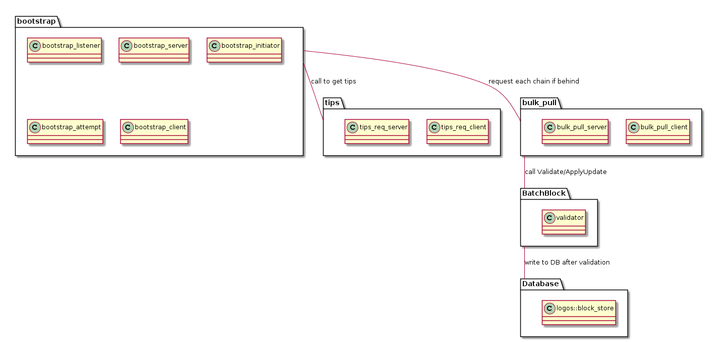

#4. use-case diagrams

The use case here is that a node that is bootstrapping, requests from the peer node its state, and ultimately retrieves its blocks where the bootstrapping node will validate and apply the blocks to the database in attempt to sync up the two databases.

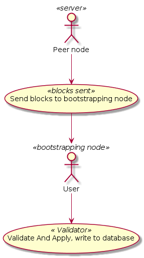

#5. state diagrams
Overall state :

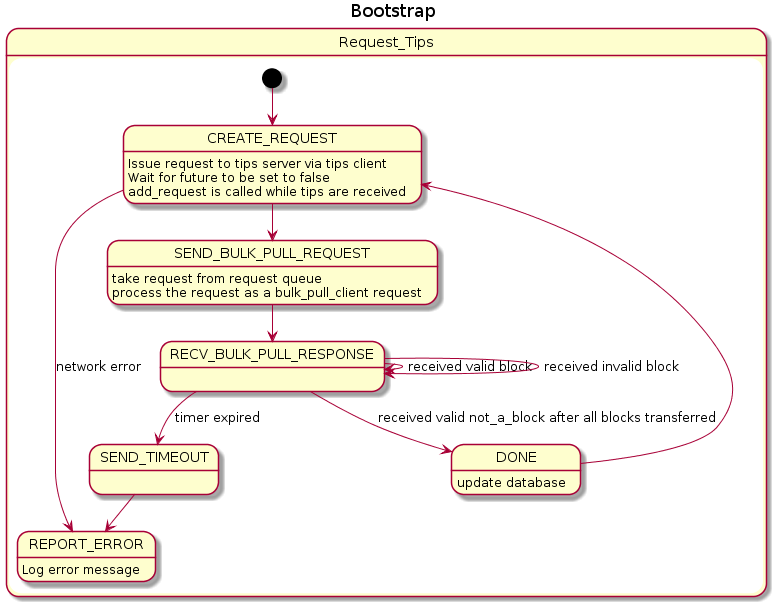

The intial sequence for initiating bootstrapping is as follows :

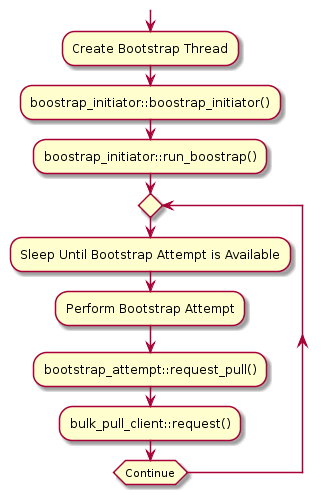

Responding to tips request and setting up a pull request :

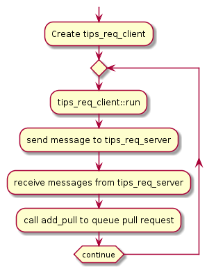

Responding to a pull request :

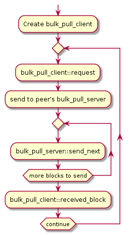

Validation of blocks :

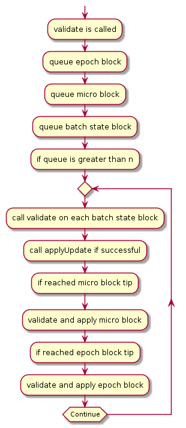

#6. classes

An overview of the main classes :

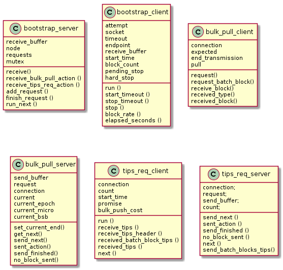

##bootstrap_listener
   This class is used to listen to connections from peers. In **bootstrap_listener::start()** are the calls to accept server sockets. The main function here is **logos::bootstrap_listener::accept_action** where new server connections are made and stored in a container called **connections**.
Of importance is the call to:

~~~C++
auto connection (std::make_shared<logos::bootstrap_server> (socket_a, node.shared ()));
~~~

Which creates the bootstrap_server class from which all servers are called. The start of the bootstrap_server logic is in the method **receive** which is also called from **accept_action**.
 
##bootstrap_server

This class is responsible for invocking the other servers. Note that this design uses a visitor design pattern rather than inheritance.  That is to say, the bulk_pull_server, and tips_req_server do not inherit from bootstrap_server. However, they are called from the server using a visitor pattern. See **request_response_visitor** for more information.  The design allows for the server to be available as a **connection** member variable inside the bulk_pull_server, and tips_req_server. A similar design is used in implementing clients.

As aforementioned, the main starting point for bootstrap_server is:

~~~C++
bootstrap_server::receive()
~~~

Which calls a Boost ASIO async_read call to start the server read from its socket. Additional methods and their purpose are:

~~~C++
void logos::bootstrap_server::receive_bulk_pull_action (boost::system::error_code const & ec, size_t size_a)
void logos::bootstrap_server::receive_tips_req_action (boost::system::error_code const & ec, size_t size_a)
void logos::bootstrap_server::add_request (std::unique_ptr<logos::message> message_a)
void logos::bootstrap_server::finish_request ()
void logos::bootstrap_server::run_next ()
~~~

Where **receive_bulk_pull_action** receives the bulk_pull requests from client and **receive_tips_req_action** receives the tips requests from client. **add_request** adds a request to the **requests** queue which is defined as:

~~~C++
std::queue<std::unique_ptr<logos::message>> requests;
~~~

Note that bootstrapping uses messages that derive from **logos::message** for representing a pull request or tip request for example.

**finish_request** is called when the bulk_pull_server finishes processing the requests. In our case, finishes walking a chain and sending all of the blocks requested back to the client. It is important to have this function called via:

~~~C++
connection->finish_request()
~~~

From inside the bulk_pull_server.

**run_next** is a method called to process the next request from the queue. Note that how this works is by retreiving a request from the requests queue mentioned above, and applying a visitor pattern as follows:

~~~C++
request_response_visitor visitor (shared_from_this ());
requests.front()->visit (visitor);
~~~

Where the **request_response_visitor** handles the various message types by invocking the correct server. For example, in the case of bulk_pull we have the request encapsualted in **logos::pull_info** object, and we apply the following method from the visitor:

~~~C++
void bulk_pull (logos::bulk_pull const &) override
~~~

Which in turn calls the bulk_pull_server in this manner:

~~~C++
auto response (std::make_shared<logos::bulk_pull_server> (connection, std::unique_ptr<logos::bulk_pull> (static_cast<logos::bulk_pull *> (connection->requests.front ().release ()))));
response->send_next ();
~~~

Notice how the connection is passed into the constructor of the bulk_pull_server and that the connection object is the bootstrap_server class.

##bootstrap_initiator
The initiator class is what starts bootstrapping. It can be called from a unit test, for example:

~~~C++
node2.bootstrap_initiator.bootstrap (node1.network.endpoint ());
~~~

Where we specify to a node a peer to bootstrap from. In normal operation, the code calls the following in a loop from node.cpp:

~~~C++
logos::node::ongoing_bootstrap()
{   ...
	bootstrap_initiator.bootstrap ();
    ...
}
~~~

Where the bootstrap is launched every n seconds. This interval is currently set to 300s (but in testing is set to much smaller value).

The main methods from bootstrap_initiator are:

~~~C++
void logos::bootstrap_initiator::bootstrap ()
void logos::bootstrap_initiator::bootstrap (logos::endpoint const & endpoint_a, bool add_to_peers)
void logos::bootstrap_initiator::run_bootstrap ()
bool logos::bootstrap_initiator::in_progress ()
std::shared_ptr<logos::bootstrap_attempt> logos::bootstrap_initiator::current_attempt ()
void logos::bootstrap_initiator::stop ()
~~~

The **bootstrap()** and **bootstrap(logos::endpoint,bool)** methods initiate bootstrapping. In the former, we select a peer from a list, and in the later, we directly initiate bootstrapping from the specified endpoint. We currently use a specific endpoint for testing. 

**run_bootstrap** is the method that runs the bootstrapping for a **bootstrap_attempt**.

The methods **in_progress** and **current_attempt** return true if there is a bootstrap in progress (i.e., when the attempt object is not null) and return the current attempt object respectively.

The **stop** method stops the bootstrapping (by calling **attempt->stop()**)

##bootstrap_attempt

This class encapsulates a given bootstrap request and effecitively is the top-level control of bootstrapping requests and networking. It is contained in **bootstrap_initiator** and itself contains the following main methods:

~~~C++
void run ();
bool consume_future (std::future<bool> &);
void populate_connections ();
bool request_tips (std::unique_lock<std::mutex> &);
void request_pull (std::unique_lock<std::mutex> &);
void request_push (std::unique_lock<std::mutex> &);
void add_connection (logos::endpoint const &);
void pool_connection (std::shared_ptr<logos::bootstrap_client>);
void stop ();
void requeue_pull (logos::pull_info const &);
void add_pull (logos::pull_info const &);
bool still_pulling ();
bool still_pushing ();
void process_fork (MDB_txn *, std::shared_ptr<logos::block>);
unsigned target_connections (size_t pulls_remaining);
bool should_log ();
~~~

The main method here is **run()** which drives the bootstrapping. From there we see calls to request_tips (which obtains the tips from the peer and produces as a side-effect the **logos::pull_info** structures queing them up into the **pulls** vector. From there, the system decides to issue **request_pull** calls on for each pull request.

Another important method here is **populate_connections** which is responsible for managing peer connections. It currently checks which peers are slow and attempts to disconnect from them. It also decides to allocate new peer connections to satisfy pull requests.

**pool_connection** allows the client servers to place a connection (with a live socket) onto an idle queue for re-use at a later point. Note that care must be taken that all re-usuable sockets are queued up upon successful completion of a request.

The helper methods **add_pull**, **still_pulling**, **target_connections**, and  **still_pushing** are used to add a pull request (called from tips client), deciding whether the system is still doing pull requests, calculating how many connections to create based on number of pulls outstanding, and determine if we are still in the process of handling push requests.

##bootstrap_client

The bootstrap_client is the driver of all client requests. It is similar to the server class in that it envokes the correct client to handle one of the possible requests (tips,push,pull). The main methods of this class are:=

~~~C++
void run ();
void start_timeout (); 
void stop_timeout (); 
void stop (bool force);
double block_rate () const;
double elapsed_seconds () const;
~~~

The **run** method is the start of the client logic. **start_timeout**, **stop_timeout** control timeouts on the socket connections. Note that all read/write operationsuse boost::asio **async_read/async_write**. The **stop** method stops the client. Passing in false implies we stop after the operation specific client finishes its request (i..e, after we finish pulling) and passing in true implies we stop immediately. 

The other two functions are for calculating the block rate and elapsed time (since the client started), respectively.

##bulk_pull_client

The **bulk_pull_client** is responsible for making a connection to the peer given a request for a pull. A pull request is encapsulated using **logos::pull_info** class and is stored in a queue called **pulls** inside the bootstrap.cpp code. A given pull is taken from the top of the queue and processed using **request_pull**. This is a call to the **bulk_pull_client** passing in the pull_info an the connection object which is the bootstrap_client class. Inside the client is the code that handles making asynchronous requests via boost::asio to the server.

The main methods of this class are:

~~~C++
void request (); 
void request_batch_block();
void receive_block (); 
void received_type (); 
void received_block (boost::system::error_code const &, size_t);
~~~

Where **request** is the start of the request to the peer. **request_batch_block** is specifically for logos blocks. The async_read/async_write calls used require callbacks and are setup in a so-called composed operation. The methods which are listed in order of execution are **receive_block**, **received_type**, and **received_block**. These receive the blocks in three stages, first the response from the initial request, then the type (a single character read and tested for block type), and then the actual block that is sent. In our case, one of **Epoch**, **Micro**, or **Batch State Blocks**. Once the code receives a block, it calls the validator class to pass the block (which is represented as a shared_ptr) to the validator for processing.
The validator uses the respective **Validate** and **ApplyUpdate** methods of each of the supported block types.

##bulk_pull_server

The **bulk_pull_server** is responsible for transferring blocks from the peer to the client. It is created inside bootstrap.cpp via the method
**logos::bootstrap_listener::accept_action** which creates a connection object using: **auto connection (std::make_shared<logos::bootstrap_server> (socket_a, node.shared ()));**

Notice that this is where the connection for the **bootstrap_server** is created. The actual call to create **bulk_pull_server** happens in bootstrap.cpp, method in **request_response_visitor** called **bulk_pull**. The visitor is called from **bootstrap_server::run_next** where a request is pulled of the queue and processed using the visitor pattern.

The main methods in this class are:

~~~C++
void set_current_end ();
std::unique_ptr<logos::block> get_next ();
void send_next ();
void sent_action (boost::system::error_code const &, size_t);
void send_finished ();
void no_block_sent (boost::system::error_code const &, size_t);
~~~

Where **set_current_end** sets the hash that when reached implies we reached the end of transmission. **get_next** gets the next block in the chain, **send_next** sends the next block. Like the **bulk_pull_client**, the server uses boost::asio to do the async_write. Therefore, it requires several methods for performing the composed operation. These methods are (in order of execution), **sent_action**, **send_finished**, and **no_block_sent**. The code uses **sent_action** to acknowledge the block has been sent. **send_finished** is the last call made to send the last block marked by a **not_a_block** type. This is important because it signals to the client the end of transmission. The server does not validate the blocks it sends, as the validation is left on the client side.

##tips_req_client
The **tips_req_client** sends the initial message to the  **tips_req_server**. In the message, is a request for tips for batch state blocks, micro blocks and epoch blocks. The message is relatively simple, and its response is handled in the is class. It is expected that the server sends back its tips (the peer's tips) for which we intend to decide what to do with each tip in terms of making requests to the bootstrap code to pull or push. The main methods here are:

~~~C++
void run ();
void receive_tips ();
void receive_tips_header ();
void received_batch_block_tips (boost::system::error_code const &, size_t);
void received_tips (boost::system::error_code const &, size_t);
~~~

**run** starts the process of sending a request to the server. **receive_tips**, **receive_tips_header**, **receive_batch_block_tips**, and **received_tips** are networking code to receive the tips, and **received_tips** does the processing of calling the bootstrap code to request a pull or push. Note that the logic deciding what to do is based on sequence numbers returned from the server. Because we request the entire chain for a given delegate, the chains have to be linked from micro block transitions.

##tips_req_server
The **tips_req_server** is responsible for sending the peer's tips so that the requesting node can determine where it is. The main methods here are:

~~~C++
void send_next ();
void sent_action (boost::system::error_code const &, size_t);
void send_finished ();
void no_block_sent (boost::system::error_code const &, size_t);
void next ();
void send_batch_blocks_tips();
~~~

Where **send_next** decides which tip to send next, **send_action** is used for asynchronous write of the tip to the network, and **send_finished** and **no_block_sent** send the signal that the transmission is complete. **send_batch_block_tips** is the main method here which is responsible for sending tips information for each delegate. Note that the client always requests the epoch and micro blocks first, followed by batch blocks.

##BatchBlock::validator

This class is purpose is to **Validate** and **ApplyUpdate** each incoming block. It sorts the queue of blocks, and calls the validation and apply of the batch state blocks, when it reaches a micro block, it validates the micro block, and when it reaches the epoch block, it validates the epoch block. The micro block is reached when we process its batch state block tips, and the epoch block is reached when we process its micro block tips. The system processes each request concurrently and queues the blocks up for processing as the downloading continues.

The main methods here are:

~~~C++
void add_micro_block(std::shared_ptr<bulk_pull_response_micro> &m)
void add_epoch_block(std::shared_ptr<bulk_pull_response_epoch> &e)
bool validate(std::shared_ptr<bulk_pull_response> block);
~~~

Where **add_micro_block** and **add_epoch_block** add received micro and epoch blocks to the validator on seperate queues. And **validate** is used to determine if the batch block is valid. Note that we queue a certain number of blocks before attempting to validate, and if we can not proceed, we wait for more blocks to arrive.

The code wraps up the epoch, micro, and batch blocks into its own internal structures to keep the modules seperated and so that bootstrapping knows little of the other components except to call the
required methods.

#7. sequence diagrams
An illustration of retry logic.

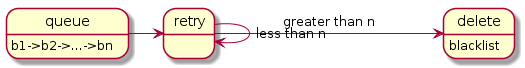

An illustration of logical bootstrapping.

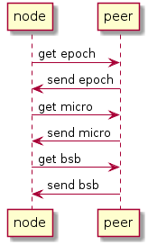

An illustration of parallel bootstrapping.

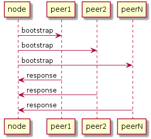

An illustration of the sequnce for bootstrap initialization and start of bulk_pull requests.

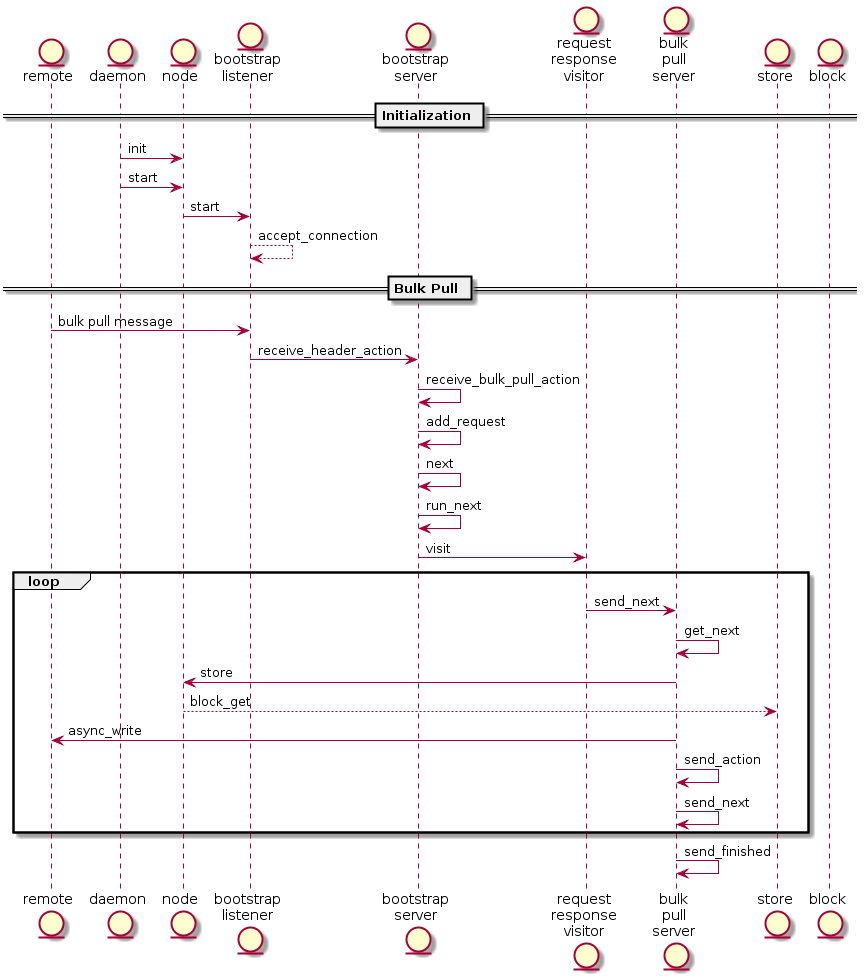

An illustration of the system functionality. This diagram shows how bootstrapping works when its up and running. Main ideas is the request for tips, the response, and then the subsequent pulls.

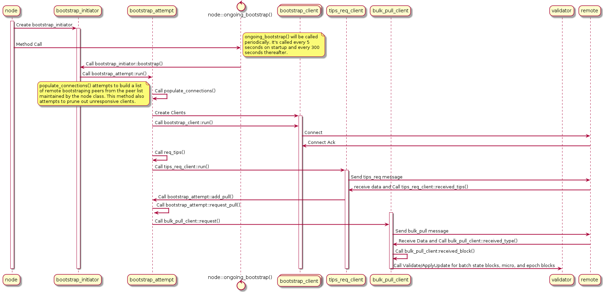

#8. resources
- Currently, the code is too aggressive in allocating sockets, and more work is needed to make sure we don't run out of sockets in a given run.

- The requests submitted by the tips client should wait until a given delegate chain is retrieved before submitting more requests for that delegate. This is currently done in *tips_req_client*

#9. implementation and algorithms
- The validation algorithm is currently:

~~~C++
queue epoch blocks
queue micro blocks
queue batch state blocks
	
bool validate()
{
     when batch state blocks queue is greater than n do
     	sort queue based on timestamp
     	iterate through each batch state block
     	    validate batch state block i
     	    apply update on batch state block i
     	
     	if we reach the next micro block tips
     	   validate micro block
     	   apply update on micro block
     	   
        if we reach the next epoch block tips
           validate epoch block
}
~~~

- Description for logical bootstrapping:

Client
Sends sequence numbers and hashes to server

Server decides to initiate bootstrapping on its end if it's behind by
Calling connection->node->ongoing_bootstrap()
Sends a message to the client indicating all is well so that
the client can proceed with the next peer.
This allows the client to set the promise to false and not initiate pulls from this peer.

Otherwise, the server looks up the next epoch from the client provided hash (read the epoch based on client provided hash, and get the next block using the next pointer) and send that block to the client.
This is in the case where the client has a sequence # less than us.
Note that the tips algorithm is run every 5 minutes, so we should still have to send the peer's epoch block tip and not go one by one here.

When the epoch is equal to us, we send our peer's micro blockchain tip
back to the client. The client then pulls the chain of micro blocks.
Note that we could also go one by one here for micro block as was suggested for epoch, but as mentioned, we should want to return the peer's micro block tip so as to get everything in bulk.

When epoch blocks arrive (in our callback) we request the associated microblocks.
When micro blocks arrive (in our callback) we request the associated bsb blocks.

When we reach the end of epoch block transmission, it should pull the remaining micro blocks by going from the end epoch block micro block tip to the micro block tip on the peer.

When we reach the end of micro block transmission, it should pull from
the last micro block bsb tips to the peer's bsb block tips for a request to be made for remaining bsb blocks.

Note that the peer's tip for epoch, micro, and bsb should be retrieved and perhaps sent to the pull request such that it can actually ask for the remaining blocks. We want to avoid not being able to sync to the latest because we reached the end prematurely due
to the times when epoch and micro blocks are generated.

This implies changes in the tips.cpp code and in the callback handlers of epoch/micro block.
 
- parallel bootstrapping:

This is already implemented within the code. It selects peers from a list and tries to bootstrap from them. What is needed here is testing + integration with p2p list such that we can get our peers from p2p instead of the legacy peer list. We also may want to implement a blacklist of peers to protect against bad blocks sent from untrusted peers.

- consolidate into one message:

 This will be done as mentioned in our logical bootstrapping design.
